Git
===

Git is an open-source **distributed version control system** that allows developers and operations teams to collaborate, track changes, and manage code efficiently. It’s the foundation of modern DevOps workflows.

### 📁 Repository Types

Git works with two types of repositories:

*   **Local Repository** — Stored on your machine
    
*   **Remote Repository** — Hosted on platforms like GitHub, GitLab, Bitbucket
    

### 🔄 Local Repository Stages

Every local Git repo has three key areas:

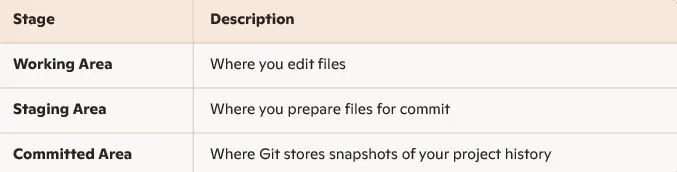

### 🛠️ Installing Git on Linux

Follow the official guide: [_Git installation_](https://git-scm.com/book/en/v2/Getting-Started-Installing-Git)

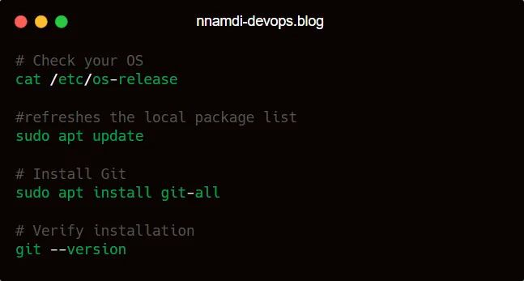

Without updating local package, your system might try to install an outdated version

### 🧪 Getting Started with Git

🔧 Initialize a Repository

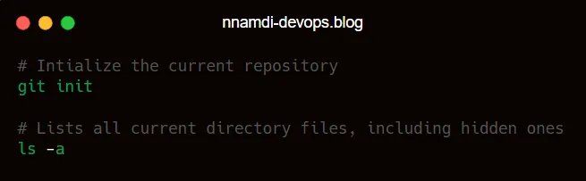

Think of git init as saying: _“Hey Git, start keeping track of everything in here

📝 Create and Track a File

Let’s walk through a practical example:

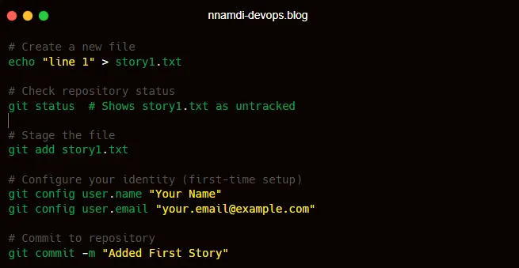

**What just happened?** You’ve created a snapshot of your file that Git will remember forever.

✏️ Modifying Files
------------------

When you modify an existing file, Git detects the changes

Quick Refresher: As covered in the [Linux Foundations](https://medium.com/@hedobriggs/git-3fe94b838f90#), the double greater-than sign (>>) appends content to an existing file without overwriting it. A single > would replace the entire file content.

Shows story1.txt as modified

### 🔄 Undoing Changes

If what you did above was a mistake, Git’s got your back with the restore command

Reverts to last commit

However, if the changes are intentional:

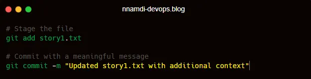

📚 Real-World Scenarios You’ll Encounter
----------------------------------------

✅ Scenario 1: Managing Multiple Changes

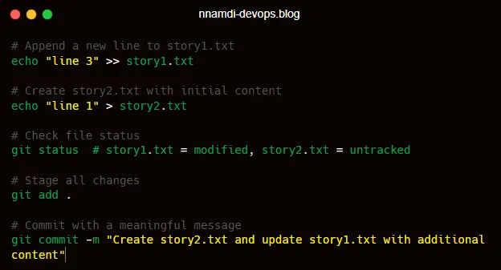

Best practice: Keep commits small and focused. Easier to track, easier to fix.

✅ Scenario 2: Unstaging Files

Have you accidentally staged a file that you are not ready to commit ?

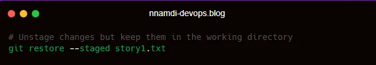

Reverts staged file to working state

✅ Scenario 3: Working with Mixed States

You can selectively stage files when some are ready and others aren’t

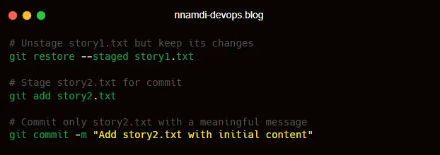

✅ Scenario 4: Excluding Files from Version Control

Some files don't belong in version control (credentials, logs, local configs):

🌿 Branching in Git
-------------------

Branches are one of Git’s most powerful features. They’re pointers to commits that let you experiment without affecting the main codebase.

🔧 **Branch Commands**

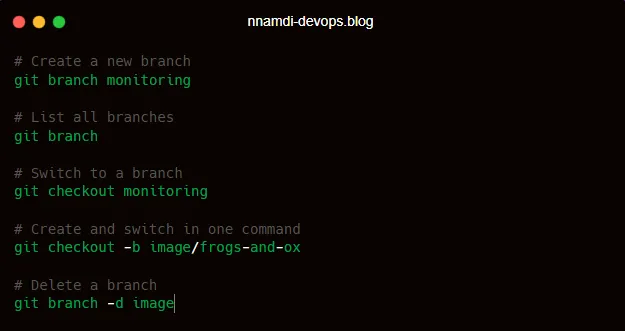

🔍 **HEAD & Logs**

HEAD is a special pointer that indicates your current position in the repository. Use git log to see where HEAD is pointing and view your commit history.

🔀 Merging Branches
-------------------

After finishing work on a feature branch, you’ll want to merge it into the main branch

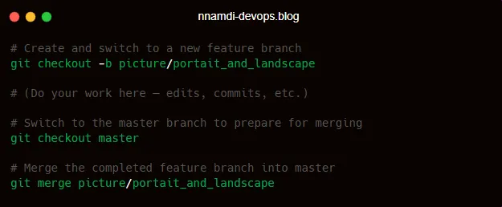

Always switch to the branch you want to merge **into**

Types of Merges

*   **Fast-Forward Merge** → When the target branch hasn’t changed, Git simply moves the pointer forward. Clean and linear.
    
*   **Three-Way Merge** → When both branches have diverged, Git creates a new merge commit that combines both histories.
    

🌐 Working with Remote Repositories
-----------------------------------

Working on a repo locally is great practice, but in the real world, collaboration happens online. Teams use platforms like GitHub, GitLab Bitbucket so everyone can share code, review changes, and contribute to the same project seamlessly

🔧 Remote Setup

git remote add origin [https://github.com/user/repo.git](https://github.com/user/repo.git) git remote -v # View remotes

🔧 **Setting up a Remote Repo****
🧠** Thought Process:
You’ve built something locally. Now you want to share it with your team or back it up online. First, you need to connect your local repo to a remote one.

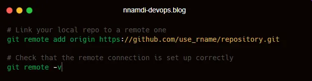

🚀 **Pushing Your Work to a Remote Repo****
🧠** Thought Process:
You’ve made changes locally and want to publish them online. The below is what you have to do for your your team to seeyour work.

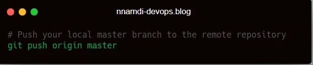

🔄 **Syncing with a Remote Repo****
🧠** Thought Process:
Before you start working, make sure your local repo is up to date. This prevents conflicts and ensures you're building on the latest version.

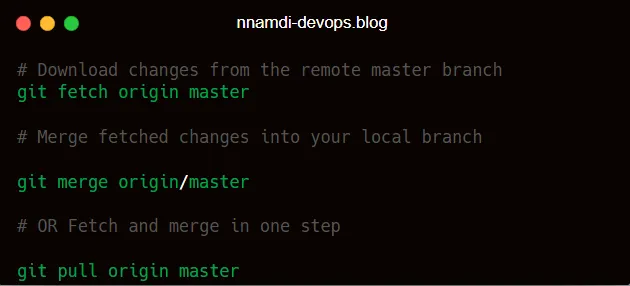

A downside of the one-step approach is that conflicts may appear without warning

⚔️ **Handling Merge Conflicts****
🧠** Thought Process:
Conflicts happen when two people change the same file. Git flags the conflict so you can resolve it manually.

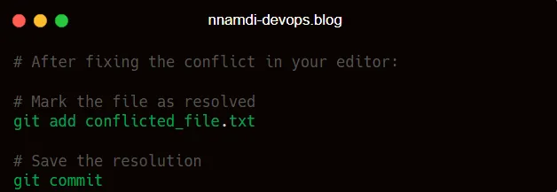

🧬 **Step 5: Merge vs Rebase
🧠** Thought Process:
Both commands integrate changes, but they handle history differently

Use merge to keep history clear, rebase to keep it neat.

🔧 **Step 6: Interactive Rebase****🧠** Thought Process:When working on a project, it’s easy to end up with a messy commit history full of small “incremental” changes. Before sharing your work, it’s best to tidy up by editing,combining or reordering those commits

🪜 i. What to do:
See your recent commits

example output

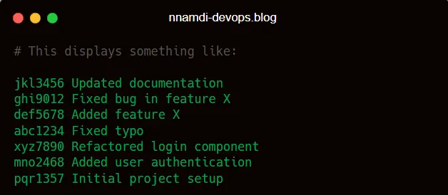

Count from the top. If you want to clean up the last 4 commits, you’ll use HEAD~4
    

ii. Start the interactive rebase

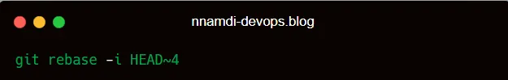

Show last 4commits only
    

This opens a list like:

iii. **Edit the list**
You can change the word pick to:

*   squash → combine commits
    
*   reword → change commit message
    
*   drop → remove a commit
    

Example:

This will merge the first three commits into one.
    

iv. **Save and finish**
Git will ask you to write a new commit message for the squashed commits. Note that you can keep all messages, edit them, or write a new one.

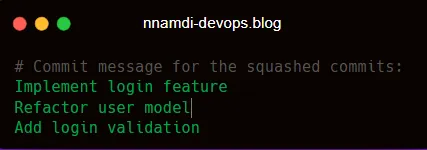

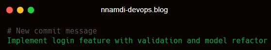

Save and close the editor

V: Verify the completed rebaseOnce the rebase finishes, confirm the result with

You should now see:

Your commit history is now cleaner and easier to understand

### 🍒 **Cherry-Pick**

If you want to grab a specific commit from another branch and apply it to your current one?
\* Use: git cherry-pick

for example:

### 🔁 Reset vs Revert

These both “undo” changes, but in very different ways:

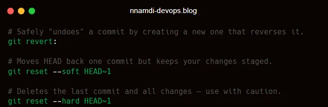

Think of revert as “undo with a safety net” and reset as “rewind and erase.”

### 📦 Git Stash

If you need to pause your work without committing. Go ahead to “Stash it!”

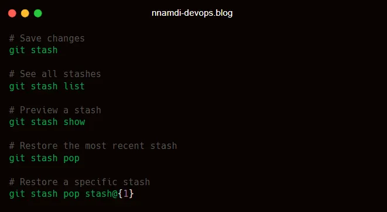

Great for switching branches without losing your work-in-progress

### 🕵️ Git Reflog

Do you need to see everything that’ happening in your repo (even thing you’ve undone or reset?

\* Use : git reflog

Useful for recovering lost commits or undoing mistakes.

Git is like your personal assistant for coding because it helps you track changes, collaborate with others, and fix mistakes without breaking a sweat. In due time, things like branching, merging, and cleaning up your commit history become second nature.

The above has given a solid introduction on the essentials, ensure to create a repo, push your work online, tidy up your commits, and recover from those “Gbas Gbos” moments. The more you use Git, the more confident and efficient you’ll become.

So keep experimenting, stay curious, and don’t worry if you mess up cos Git’s got your back.
