Linux Foundations
=================

Linus Torvalds in 1991 created an operating system that laid the foundation to what we know now as Linux. It is open source and has evolved into different forms and shapes from smart phones to super computers.

From cheat sheets to full-blown tutorials, the internet is overflowing with guides. So instead of repeating history, this blog will focus on practical application, real-world relevance, and how Linux fits into the DevOps journey.

Linux is the backbone of modern infrastructure. Whether you’re deploying containers, managing CI/CD pipelines, or provisioning cloud resources, chances are you’re doing it on a Linux-based system. It’s not just an operating system it’s the environment where automation lives and breathes.

Let this be your watchword: You don’t need to memorize every command or master every distribution. What you do need is confidence in the terminal, navigation, clarity on file, folder, permission management, and the ability to script your way out of repetitive tasks.

📁 1. Folder Management
-----------------------

Before you can do anything meaningful in Linux, you need to understand how files and folders are organized. Everything starts from the **root directory /**, and from there branches out like a tree.

### 🌍 Relative vs Absolute Paths

*   **Absolute path** → Think of it like a **full home address**. It starts from the root / and points exactly where a folder is located.Example: _**cd /home/devops-blog/Documents**_
    
*   **Relative path** → Think of it like saying **“from here, go into the next room.”** It depends on your current location in the terminal.Example: _**cd Documents**_
    

### 🔧 Commands to Know

*   **mkdir** folder\_name → Create a new folder
    
*   **mkdir** -p parent/child/grand → Create a full directory tree
    
*   **pwd**→ Prints current directory
    
*   **ls** → List files and folders
    
*   **ls -la** → List all (including hidden) files.
    
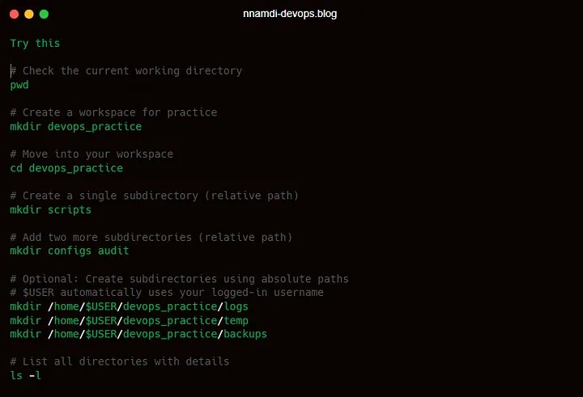

Whether you’re setting up environments, organizing scripts, or prepping config files, mastering these basics is essential. It’s the first step in building clarity and control into your workflow

📄2. Creating and Editing files
-------------------------------

Now let’s add some content into the folders. Files are where your actual work lives for example scripts, configs, logs, and more are contents of a file and this can be stored in any format ranging from pdf, txt, etc.

### 🔧 Commands to Know:

*   **touch** filename → Create an empty file
    
*   **echo** “text” > filename → Create a file with content
    
*   **cat** filename → View file content
    
*   **vi** filename → Edit file content
    
*   **nano** filename → Edit file content
    

📝 i. **Create and Edit a File Using** vi

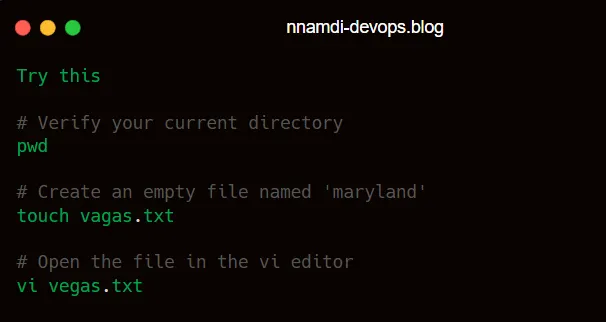

A powerful editor built into almost every Linux system for efficiency from the scratch

Once you’re inside the vi editor:

1.  Enter edit modePress the i key to start inserting text.
    
2.  Type your contentWrite anything you want — e.g., This is my first Linux file.
    
3.  Exit edit modePress the Esc key to stop editing.
    
4.  Save and quitType :wq! and press Enter
    

*   w = write (save)
    
*   q = quit
    
*   ! = force the action (useful if the file is read-only or new
    

📝 ii. **Create and Edit a File Using** nano

Nano is one of the easiest text editors in Linux. It’s beginner-friendly, intuitive, and doesn’t require memorizing keyboard shortcuts like vi

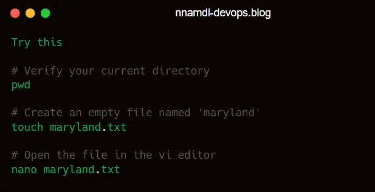

A text editor that creates and edits files without needing to memorize complex commands

Once you’re inside nano:

1.  **Start typing** — You’re already in edit mode. Just write your content.
    
2.  **Save and exit** —
    

*   Press Ctrl + O to save (you’ll be asked to confirm the filename)
    
*   Press Enter to confirm
    
*   Press Ctrl + X to exit the editor
    

📝 iii. **Create and Input File Content Using** echo

If you just want to create a file with a quick line of text, like a config setting or a log entry — echo is your best friend.

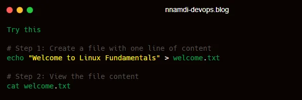

Echo is the quick way to create a file and drop in content with a single command

You can also append content to an existing file

Append new content to a file without needing to open it.

Use > to overwrite a file, and >> to add to it without erasing the existing content.

📦 3. Copying & Moving Files
----------------------------

Once you’ve got your folders set up, the next thing you’ll want to do is move things around. This is where two simple, but powerful commands (Copy and Move) come in:

*   **cp stands for “copy”**—it makes a duplicate of a file or folder and places it somewhere else
    
*   **mv stands for “move”**—it shifts a file or folder from one place to another. You can also use it to rename things.
    
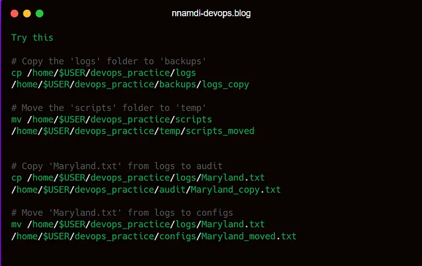

If you’re ever unsure, try **cp -rv** to see a verbose output of each file being copied.

🗑️ 4. Deleting Files & Folders
-------------------------------

Linux uses the **rm** command to delete files and folders. Use with caution because the deletion is instant, permanent and unrecoverable.

🔧 Commands to Know:

*   **rm** filename → Deletes a file
    
*   **rm -r** filename → Deletes a folder and everything inside it
    
*   **rm -rf** filename → Force deletes a folder (without prompts)
    
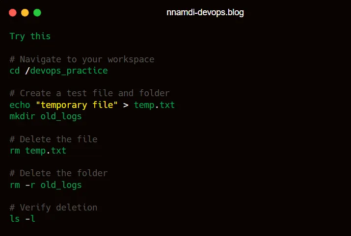

**rm is** powerful and irreversible. Always double-check the path before using it

🌲5. Directory Structures
-------------------------

To have a visual representation of your folder hierarchy, the tree command is your best friend. It displays directories and files in a structured format, making it easier to understand nested folders.

🔧 Commands to Know

*   tree → Displays the directory structure starting from the current folder
    
*   tree folder\_name → Shows the structure of a specific folder
    
*   tree -L 2 → Limits the depth of the tree to 2 levels
    
*   tree -a → Includes hidden files in the output
    

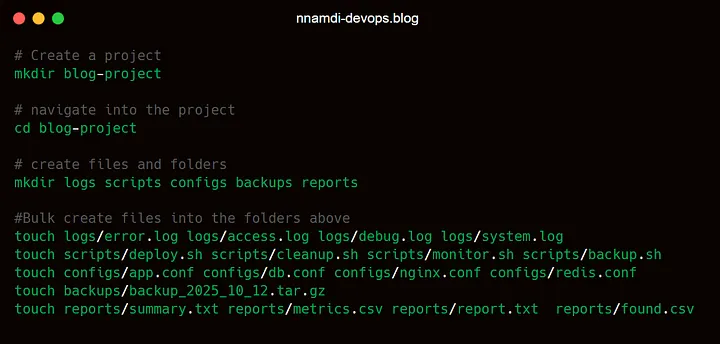

After running the tree command the below displays

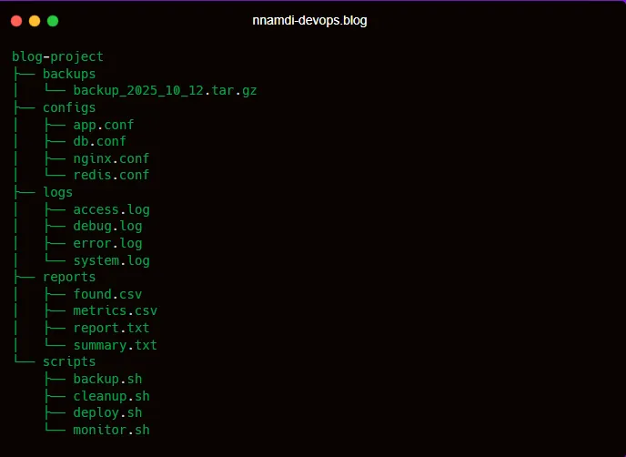

This structure gives you a clean, organized view of your project folders and files

🔐 6. Permissions & Ownership
-----------------------------

In Linux, file and folder permissions are divided into three levels: _Owner_, _Group_, and _Others_. Each level is assigned a numeric value based on the type of permission: read = 4, write = 2, and execute = 1. These numbers are added together to determine access rights. For example, if the Owner has full access (read + write + execute), the value is 7. “Stay with me”

In Linux, every file and folder has **three levels of access**:

*   **Owner** — The user who created the file
    
*   **Group** — A set of users who share access
    
*   **Others** — Everyone else
    

Each level is assigned permissions using numbers:

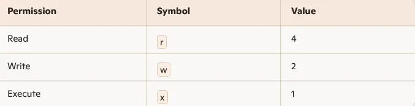

To set permissions, you **add the values** together:

*   r + w + x = 4 + 2 + 1 = 7 → Full access
    
*   r + x = 4 + 1 = 5 → Read and execute
    
*   r = 4 → Read only
    

🔧 Commands to Know:

*   **chmod**
    
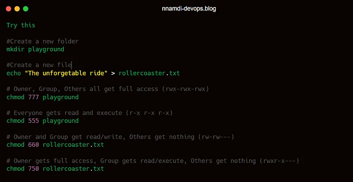

One wrong permission setting can expose sensitive data or break your deployment

🤖7. Shell Scripting in Linux
-----------------------------

Shell scripting lets you automate tasks by writing a series of commands in a file. Instead of typing each command manually, you write them once and run them whenever you need. It’s perfect for backups, file creation, cleanup, and more.

📌 What Is a Shebang?

Before your script runs, Linux needs to know **which shell** should interpret the commands. That’s where the **shebang** comes in. Most Linux systems default to bash, which is why we use #!/bin/bash in our scripts.

🧠 Common Shells in Linux

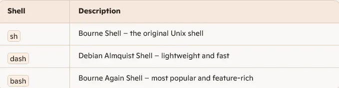

Example: Your First Script

Let’s build a script that creates a folder, adds a file, and writes a message inside it.

Step 1: Create the script file: touch first\_script.sh

Step 2: Write the content of the script: nano first\_script.sh

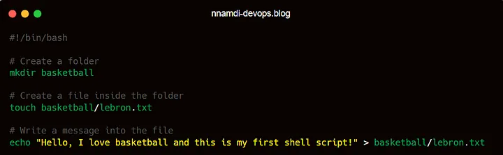

Without the shebang (#!/bin/bash), your script might not run correctly

Step 3: _Press_ Ctrl + O to save, then Enter to confirm. Press Ctrl + X to exit

Step 4: Make the script executable → chmod +x first\_script.sh

Step 5: Run the Scrip → ./first\_script.sh

Step 6: Check the result of the running script: cat basketball/james.txt ( it should return “_Hello, I am a Lebron James fan, and this is my first shell script!”)_

🌐8. Networking & Debugging
---------------------------

🔧 Commands to Know:

*   ping → Tests if a host is reachable
    
*   curl → Fetches data from a URL
    
*   netstat → Shows network connections and port
    
*   ip a → Displays IP address configuration

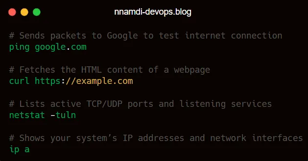
    

📊 9. System Monitoring
-----------------------

Monitoring your system helps you track performance, troubleshoot issues, and manage resources.

🔧 Commands to Know:

*   df -h → Shows disk usage in human-readable format
    
*   free -h → Displays memory usage
    
*   top → Live view of running processes
    
*   htop → Enhanced version of top(verify install status)
    
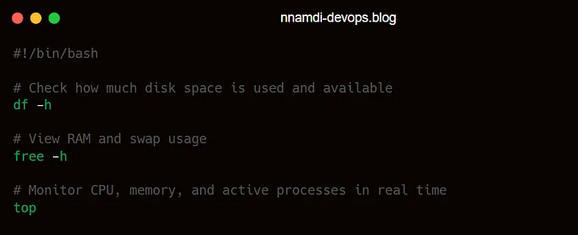

Press q to exit top. Use htop for a more colourful, user-friendly interface

👥 10. User Management
----------------------

Linux is a multi-user system. You can create, delete, manage users and groups to control access.

🔧 Commands to Know:

*   adduser username→ Adds a new user
    
*   deluser username → Removes a user
    
*   groupadd groupname → Creates a new group
    
*   usermod -aG-group username→ Adds a user to a group
    
*   id username→ Shows user’s UID, GID, and groups
    

Always use sudo for user and group management to ensure proper permissions

When something breaks (and it will), these tools help you figure out _why_. They’re your eyes and ears in the system.

🧠11. Final Thoughts
--------------------

Linux isn’t just a skill, it’s a mindset. It teaches you to think in commands, to automate with intention, and to troubleshoot with precision. Whether you’re deploying a container or debugging a CI/CD pipeline, Linux is always in the background, quietly powering your tools.

📌 Your Homework

*   Create and organize folders in your terminal.
    
*   Practice copying and moving files.
    
*   View the directory hierarchy.
    
*   Experiment with permission settings.
    
*   Write a simple script to automate a task.
